# OrangeHRM Automation Testing

## Overview

This project demonstrates **automated testing of the OrangeHRM demo website** using **Python, Selenium WebDriver, and the unittest framework**.

The goal of this project is to automate testing of the **Login functionality and Admin module** of OrangeHRM. The project includes both **positive and negative test cases**, and screenshots are captured during test execution.

Website used for testing:
https://opensource-demo.orangehrmlive.com/

---

## Technologies Used

* Python
* Selenium WebDriver
* unittest framework
* Chrome WebDriver

---

## Test Case Documentation

The detailed manual test cases for the OrangeHRM Admin module are documented in the Excel sheet included in this repository.

**File:** `orangehrm_admin_test_cases.xlsx`

The Excel sheet contains:

* Test Case ID
* Test Scenario
* Test Steps
* Test Data
* Expected Result
* Actual Result
* Status
* Screenshot reference

---

## Automated Test Cases

### Positive Test Cases

1. Valid login
2. Open Admin module
3. View System Users page
4. Search user
5. Reset search
6. Open Add User page
7. User role dropdown
8. Dashboard visibility
9. Admin menu visibility
10. Logout

### Negative Test Cases

11. Invalid password
12. Empty username
13. Empty password
14. Invalid username
15. Blank login

---

## Project Structure

```
orangehrm-selenium-test-automation
│
├── orangehrm_test.py
├── README.md
├── requirements.txt
├── orangehrm_admin_test_cases.xlsx
│
└── screenshots
    ├── TC01_valid_login.png
    ├── TC02_admin_module.png
    ├── TC03_system_users.png
    ├── TC04_search_user.png
    ├── TC05_reset_search.png
    ├── TC06_add_user.png
    ├── TC07_user_role.png
    ├── TC08_dashboard.png
    ├── TC09_admin_menu.png
    ├── TC10_logout.png
    ├── TC11_invalid_password.png
    ├── TC12_empty_username.png
    ├── TC13_empty_password.png
    ├── TC14_invalid_username.png
    └── TC15_blank_login.png
```

---

## How to Run the Project

### 1 Install Dependencies

```
pip install selenium
```

or

```
pip install -r requirements.txt
```

### 2 Run the Test Script

```
python orangehrm_test.py
```

---


# Screenshots of Test Execution

## TC01 – Valid Login

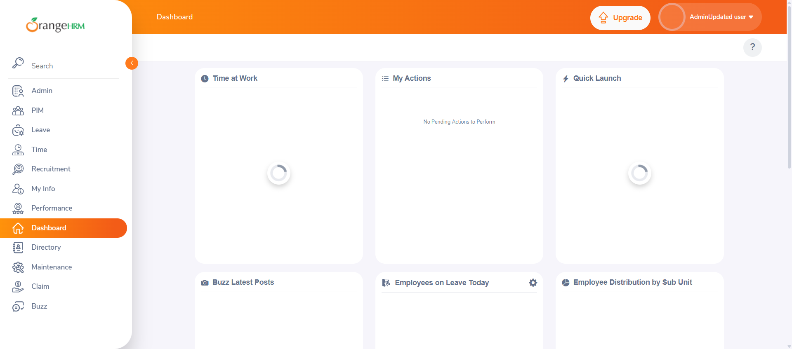

---

## TC02 – Admin Module

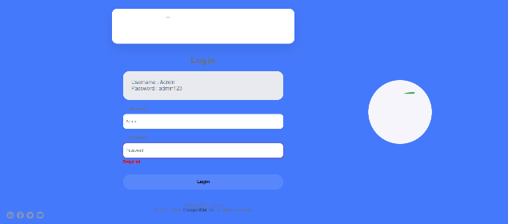

---

## TC03 – System Users Page

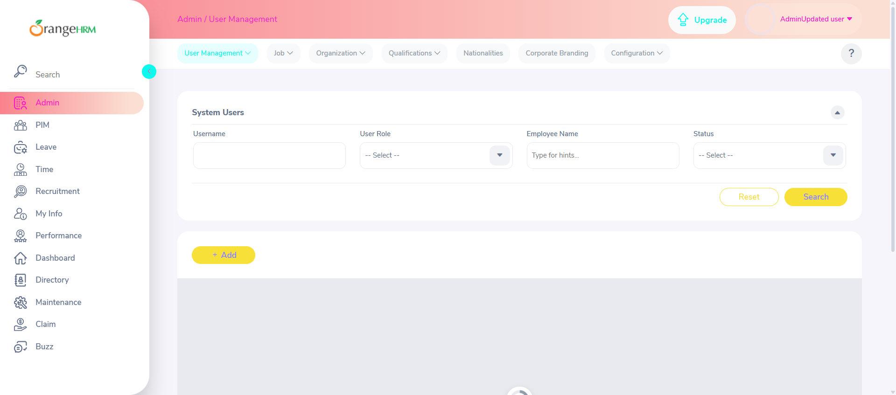

---

## TC04 – Search User

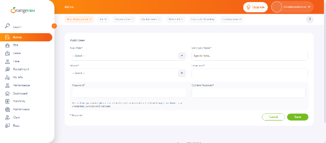

---

## TC05 – Reset Search

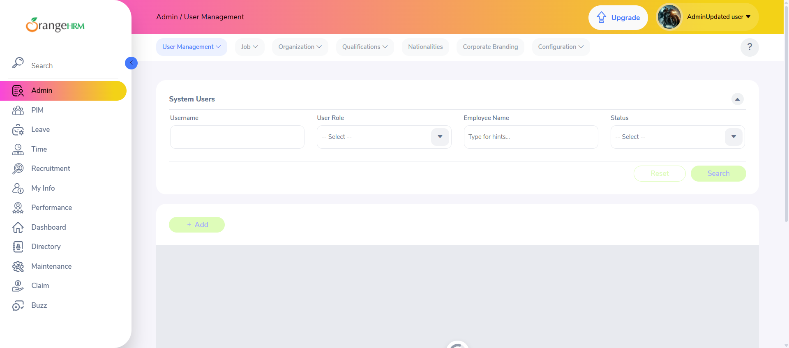

---

## TC06 – Add User Page

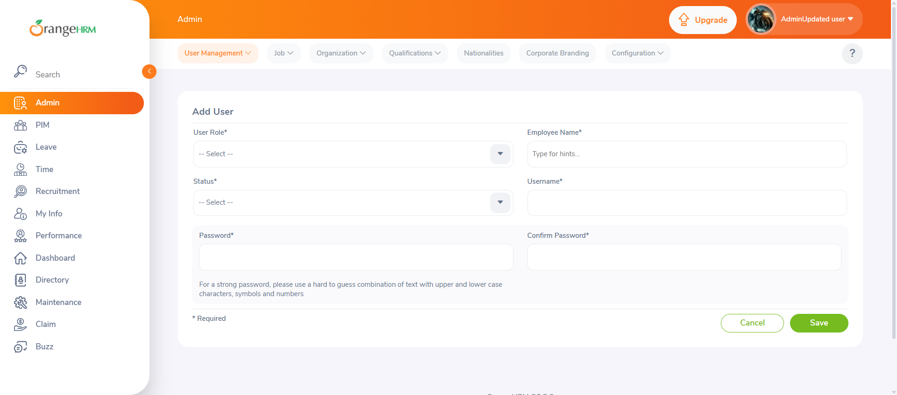

---

## TC07 – User Role Dropdown


---

## TC08 – Dashboard Visible

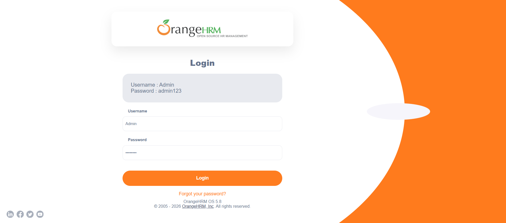

---

## TC09 – Admin Menu Visible

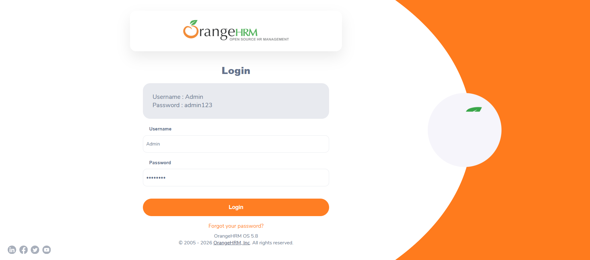

---

## TC10 – Logout

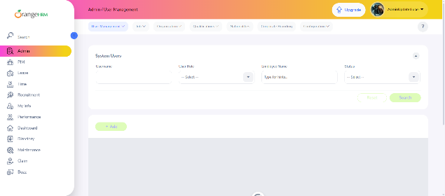

---

## TC11 – Invalid Password

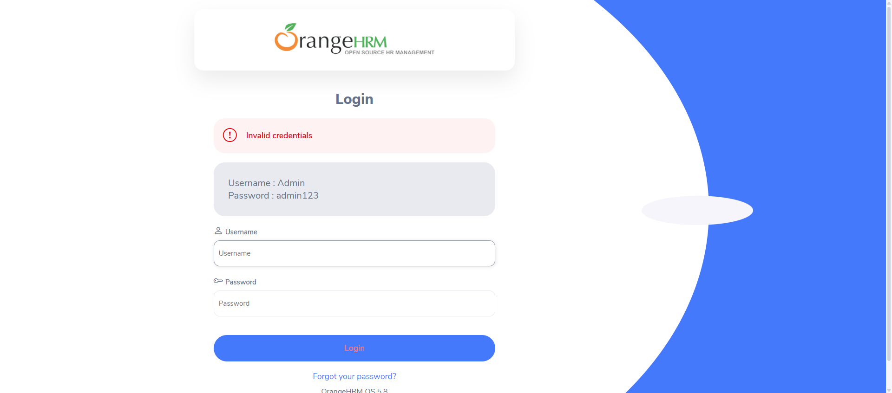

---

## TC12 – Empty Username

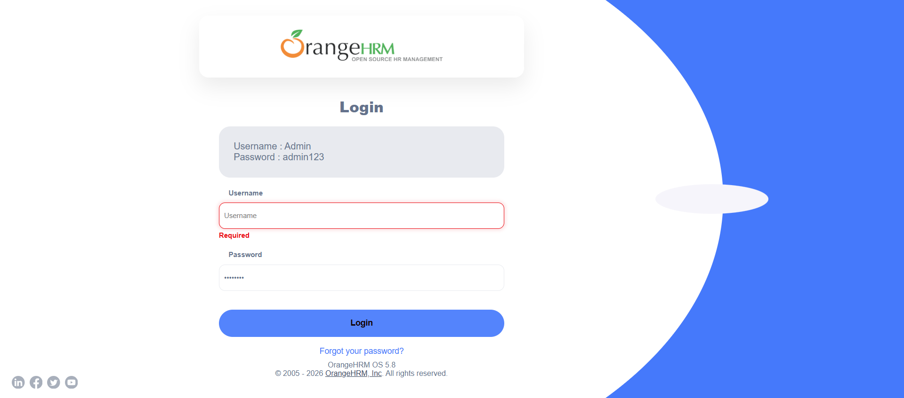

---

## TC13 – Empty Password

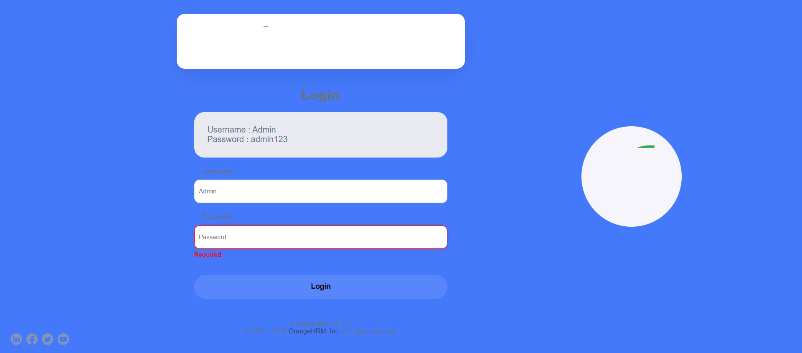

---

## TC14 – Invalid Username

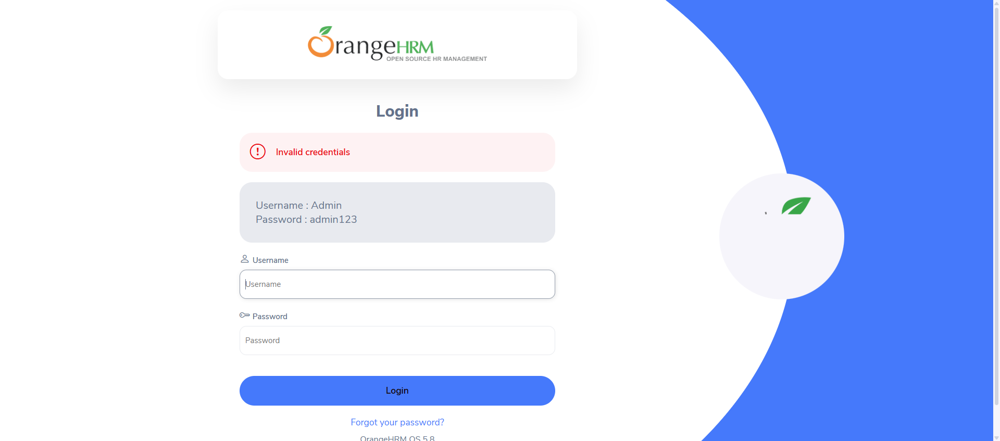

---

## TC15 – Blank Login

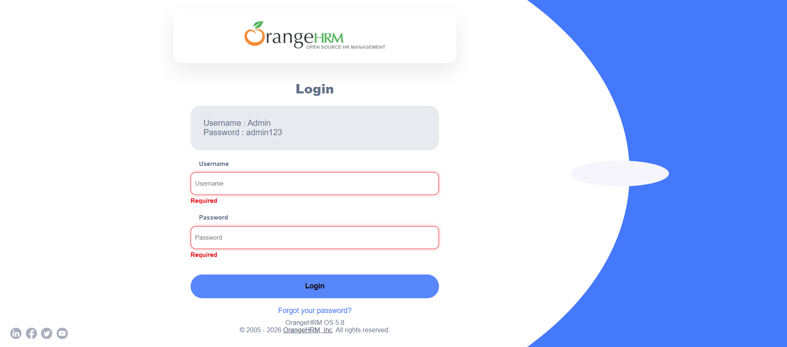

---
